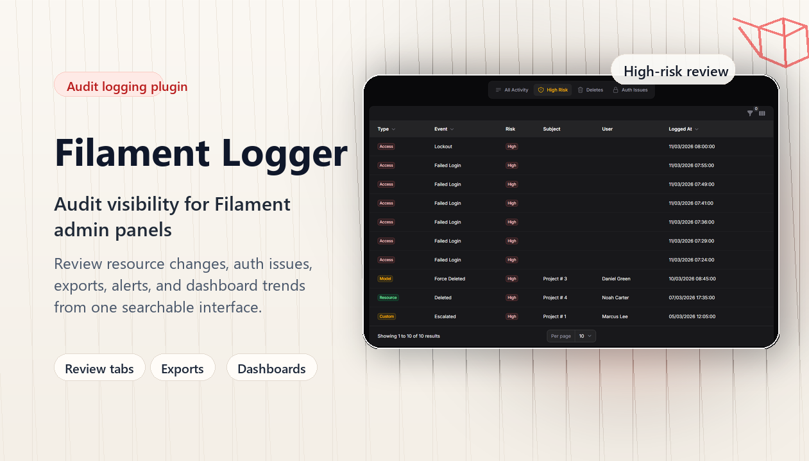

> **Community-maintained continuation of the original Filament Logger package by [Z3d0X](https://github.com/Z3d0X).**

# Filament Logger

[](https://packagist.org/packages/mradder/filament-logger)
[](https://packagist.org/packages/mradder/filament-logger)
[](https://github.com/MrAdder/filament-logger/actions/workflows/run-tests.yml)
[](https://github.com/MrAdder/filament-logger/actions/workflows/phpstan.yml)
[](https://github.com/MrAdder/filament-logger/actions/workflows/deploy-docs.yml)
[](https://sonarcloud.io/summary/new_code?id=MrAdder_filament-logger)
[](https://packagist.org/packages/mradder/filament-logger)

Filament Logger is an audit log and activity log package for Filament admin panels.

Built on [spatie/laravel-activitylog](https://spatie.be/docs/laravel-activitylog), it adds a ready-made Filament activity resource plus automatic logging for resources, models, auth events, notifications, and custom domain events.



Use it when you need to:

- review admin activity and security events inside Filament
- export audit data for compliance, support, or incident response
- trigger alerts for destructive or high-risk actions
- log custom domain events without building your own audit UI

## Highlights

- Ready-made Filament audit log resource with searchable filters, structured diffs, saved review tabs, and date presets
- CSV and JSON exports for filtered audit data
- Dashboard widgets for top users, top events, activity spikes, and high-risk actions
- Resource and model lifecycle logging, including create, update, delete, restore, force-delete, and replicate flows
- Auth event logging for login, logout, failed login, lockout, password reset, and 2FA recovery usage
- Notification logging plus alerting hooks for mail, Slack, and Discord webhooks
- Custom event API for domain-specific audit events
- Sensitive data redaction, anonymized IP logging, and stricter authorization defaults
- Configurable ignored fields per model and per resource
- Built-in pruning command for retention by age and log name

## Requirements

| Package | Version |
|---|---|
| PHP | `^8.2` |
| Filament | `^3.0`, `^4.3.1`, or `^5.0` |
| Laravel contracts | `^11.0` or `^12.0` |

Filament 4 support starts at `4.3.1` because earlier `4.x` releases were affected by an upstream security issue fixed in `4.3.1`. See the [Filament security advisory](https://github.com/filamentphp/filament/security/advisories/GHSA-pvcv-q3q7-266g) and the [v4.3.1 release notes](https://github.com/filamentphp/filament/releases/tag/v4.3.1).

## Quick Start

Install the package:

```bash
composer require mradder/filament-logger
```

Publish config and the Spatie activity log migrations:

```bash
php artisan filament-logger:install
php artisan migrate
```

Register the activity resource in your panel provider:

```php
use Filament\Panel;

public function panel(Panel $panel): Panel
{
    return $panel
        ->resources([
            config('filament-logger.activity_resource'),
        ]);
}
```

## Documentation

- [Documentation Site](https://mradder.github.io/filament-logger/)
- [Installation and Setup](https://mradder.github.io/filament-logger/installation)
- [Security and Authorization](https://mradder.github.io/filament-logger/security)
- [Configuration Guide](https://mradder.github.io/filament-logger/configuration)
- [Activity Review UI](https://mradder.github.io/filament-logger/activity-review)
- [Custom Events and Alerts](https://mradder.github.io/filament-logger/custom-events)
- [Roadmap](https://mradder.github.io/filament-logger/roadmap)

## Screenshots


## Changelog

See [CHANGELOG](CHANGELOG.md) for recent changes.

## Contributing

See [CONTRIBUTING.md](CONTRIBUTING.md) for contribution guidelines and [CODE_OF_CONDUCT.md](CODE_OF_CONDUCT.md) for community expectations.

## Security

Please review [our security policy](../../security/policy) for responsible disclosure details.

## Credits

- [Ziyaan Hassan](https://github.com/Z3d0X) - original developer
- [Daniel Green](https://github.com/MrAdder)
- [Spatie Activitylog Contributors](https://github.com/spatie/laravel-activitylog#credits)
- [All Contributors](../../contributors)

## License

The MIT License (MIT). See [LICENSE.md](LICENSE.md) for details.
